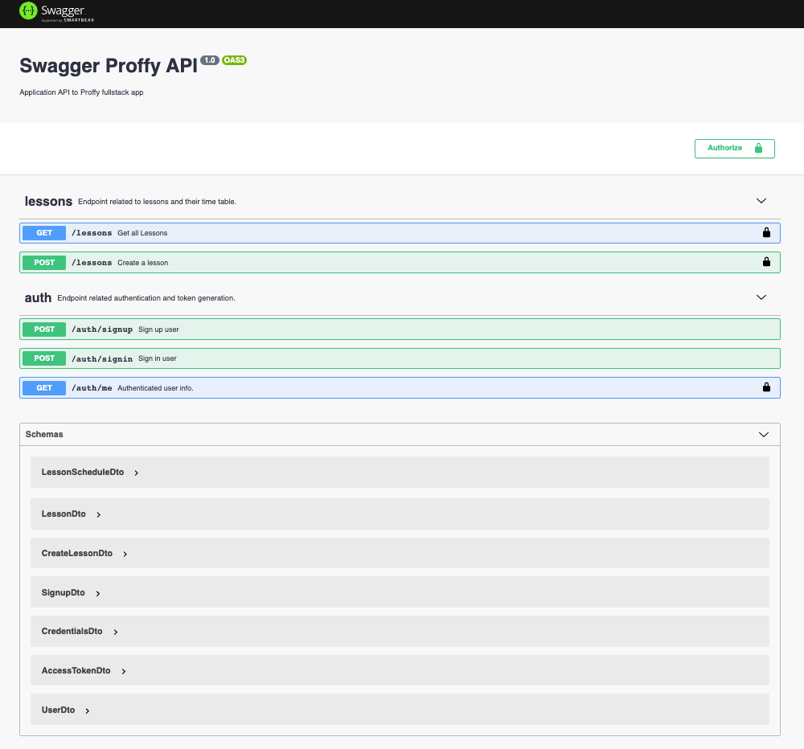

# Proffy - backend

[](https://opensource.org/licenses/MIT)&nbsp;&nbsp;
[](https://nodejs.org/)&nbsp;&nbsp;
[](https://www.typescriptlang.org/)&nbsp;&nbsp;

## Proffy 1.0

> This is the NLW project from (https://nextlevelweek.com). This backend version includes the following technologies:

- NodeJs
- ExpressJs
- Knex
- Mysql
- Swagger

<p align="center" >
    
</p>


## Quick Start

The Proffy project's structure:

```
├── src
│   ├── controllers
│   ├── database
│   ├── model
│   ├── routes
│   ├── swagger
│   ├── utils
│   ├── server.ts
├── README.md
├── docker-compose.yml
├── knexfile.ts
├── tsconfig.json
└── package.json

```

### ./app directory

The inside of the src directory looks similar to the following:

```
app
│── controllers
│── database
├── model
├── routes
├── swagger
├── utils
└── server.ts
```

**controllers**
This is where your entry point components will live. Functions that separate out the code to route requests from the code that actually processes requests.

**database**
This is where your database configuration will live.

**model**
This is where your app's models will live.

**routes**
This is where your app routes will live. It forwards the supported requests (and any information encoded in request URLs) to the appropriate controller functions

**swagger**
This is where the swagger API documentation will live.

**utils**
This is a great place to put miscellaneous helpers and utilities. Things like date helpers, formatters, etc. are often found here. However, it should only be used for things that are truely shared across your application. If a helper or utility is only used by a specific component or model, consider co-locating your helper with that component or model.

**server.tsx** This is the entry point to your app. This is where you will find the main Express component which handles http requests.

### Built With

* [Node.js](https://nodejs.org/) - JavaScript runtime built on Chrome's V8 JavaScript engine.
* [Typescript](https://www.typescriptlang.org/) - Typed JavaScript at Any Scale.
* [Expressjs](https://expressjs.com/) - Fast, unopinionated, minimalist web framework for Node.js.
* [Knex](http://knexjs.org/) - A SQL Query Builder for Javascript.
* [MySQL](https://www.mysql.com/) - The world's most popular open source database.
* [Swagger](https://swagger.io/) - API Documentation & Design Tools for Teams.

## Authors

* **Gustavo Silva** - *Initial work* - [Proffy-Server](https://github.com/gusilva/proffy-server)

## License

This project is licensed under the MIT License - see the LICENSE.md file for details
